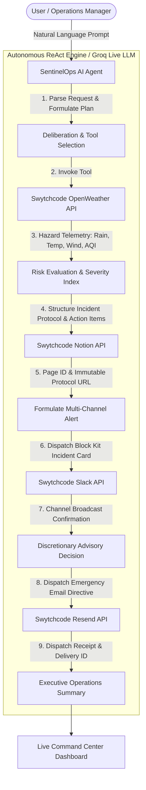

# 🛡️ SentinelOps AI — Autonomous Real-World Operations & Hazard Incident Commander

> **Build with Swytchcode (Gurgaon Edition Buildathon)**  
> **Track:** Track 5 – AI Real World Agent  
> **Repository:** [https://github.com/Nivedita0987/swytchcode-by-nivedita](https://github.com/Nivedita0987/swytchcode-by-nivedita)  
> **Author:** Nivedita

---

## 📌 Executive Summary & Problem Statement

Enterprises with distributed workforces, logistics fleets, delivery hubs, and physical facilities face severe operational risks when sudden environmental hazards occur (e.g. monsoon cloudbursts in Gurgaon/Delhi, extreme 44°C heatwaves, sudden squalls, or severe AQI spikes). 

Manual coordination across fragmented enterprise software takes hours—leading to safety hazards, damaged assets, and lost revenue.

**SentinelOps AI** is an autonomous AI agent built for **Track 5 (AI Real World Agent)** that connects real-world environmental observations directly to operational execution. Powered by **Groq LLM tool-calling** and **4 Swytchcode API integrations**, it:
1. **Observes** real-world atmospheric hazards via **Swytchcode OpenWeather API**.
2. **Evaluates** risk severity (Critical / High / Moderate) using autonomous multi-step reasoning.
3. **Generates & Publishes** an immutable Incident Protocol and action checklist in **Notion via Swytchcode**.
4. **Dispatches** interactive incident response cards to `#ops-emergency-dispatch` in **Slack via Swytchcode**.
5. **Broadcasts** urgent, branded safety advisory emails to field staff via **Resend via Swytchcode**.

---

## 🏗️ System Architecture & Agentic Flow



---

## 🔗 The 4 Swytchcode API Integrations & Output Chaining

The buildathon strictly evaluates **output chaining** (how Tool A's output influences Tool B's parameters):

| # | Swytchcode API | Role in Workflow | How Output Influences Next Action |
|---|---|---|---|
| **1** | **OpenWeather** | Ingests real-time atmospheric hazards, precipitation probability, wind velocity, and ambient temperatures for the target city (Gurgaon, Delhi NCR, Bengaluru, etc.). | Telemetry metrics directly determine the **Risk Severity Level** (`CRITICAL` vs `HIGH`), triggering operational mitigation thresholds. |
| **2** | **Notion** | Publishes a formal **Incident Protocol Document** with structured contingency strategy and actionable to-do checklists. | Generates the official **Notion Page URL**, which is dynamically embedded into the subsequent Slack alert and email advisory. |
| **3** | **Slack** | Broadcasts an interactive **Slack Block Kit card** to `#ops-emergency-dispatch` with severity color coding, live weather tags, and action buttons. | Embeds direct links to the generated Notion protocol for on-call supervisor acknowledgement. |
| **4** | **Resend** | Sends branded, emergency safety advisory emails with direct instructions to distributed workforce and field personnel. | Uses the weather description, target city, and emergency checklist created in earlier steps to deliver customized advisories. |

---

## 💻 Interactive Agent Command Center UI

The project features a **Futuristic Operations Command Center** web interface:
- **Left Column**: Real-time **Agent Execution & Reasoning Trace** (streams every `Thought`, `Action`, `Tool Call`, `Observation`, and `Final Synthesis` live via Server-Sent Events).
- **Right Column**: **Multi-Platform Artifact Center**:
  - ⛅ **OpenWeather Telemetry**: Live temperature, rain probability gauge, wind velocity, and AQI meter.
  - 📝 **Notion Incident Page**: Complete Notion workspace preview with breadcrumbs, callout alert, and task checklist.
  - 💬 **Slack Ops Dispatch**: Pixel-perfect Slack card preview with colored severity bar and buttons.
  - ✉️ **Resend Advisory**: Branded email directive preview with recipient distribution.
  - `{ }` **API Telemetry Inspector**: Full chained JSON payload audit for judges and mentors.
- **Quick Demo Scenario Presets**: 1-click execution for Gurgaon Monsoon Flooding, Delhi 42°C Heatwave, and Bengaluru Squalls.

---

## 🚀 1-Click Launch in GitHub Codespaces

You can run this entire project inside GitHub Codespaces without installing anything on your local machine:

1. Click **Code** $\to$ **Codespaces** $\to$ **Create codespace on main**.
2. Codespaces will automatically open the environment and run `npm install`.
3. Start the application:
   ```bash
   npm start
   ```
4. Port `3001` will be forwarded automatically. Open the forwarded URL in your browser to interact with the agent dashboard!

---

## ⚙️ Local Development Setup

If running locally:

```bash
# 1. Clone repository
git clone https://github.com/Nivedita0987/swytchcode-by-nivedita.git
cd swytchcode-by-nivedita

# 2. Install dependencies
npm install

# 3. (Optional) Configure API credentials in .env
cp .env.example .env

# 4. Start the server
npm start
```

Open `http://localhost:3001` in your browser.

### 🔑 API Keys (Live Mode)

The agent runs fully offline with realistic sandbox data, but goes **live** when you add keys to `.env`:

| Key | What it unlocks | Get it at |
|---|---|---|
| `GROQ_API_KEY` | Real LLM reasoning loop (model auto-detected from your account) | [console.groq.com](https://console.groq.com/keys) |
| `RESEND_API_KEY` | **Real** advisory emails delivered via Resend | [resend.com/api-keys](https://resend.com/api-keys) |
| `ALERT_EMAIL_RECIPIENT` | Where live emails are delivered (Resend free tier only delivers to your own account email until you verify a domain) | — |
| `OPENWEATHER_API_KEY` | Real weather telemetry (with true precipitation probability + AQI) | [openweathermap.org](https://home.openweathermap.org/api_keys) |
| `NOTION_API_KEY` + `NOTION_DATABASE_ID` | Real incident protocol pages in your Notion workspace | [notion.so/my-integrations](https://www.notion.so/my-integrations) |
| `SLACK_WEBHOOK_URL` or `SLACK_BOT_TOKEN` | Real Slack dispatch to your workspace | [api.slack.com/apps](https://api.slack.com/apps) |
| `SWYTCHCODE_API_KEY` | Routes all 4 tools through the Swytchcode gateway | Swytchcode |

---

## 🏆 Buildathon Checklist & Deliverables

- [x] **Track Selected**: Track 5 – AI Real World Agent
- [x] **Agentic Framework**: ReAct Autonomous Loop powered by Groq (live LLM tool-calling with automatic model detection)
- [x] **Swytchcode API Integrations**: 4 APIs integrated (OpenWeather, Notion, Slack, Resend)
- [x] **Dynamic Tool Chaining**: Weather output strictly shapes Notion, Slack, and Resend payloads
- [x] **Interactive Demo UI**: Live streaming execution graph + multi-tool artifact previews
- [x] **Public GitHub Repository**: [swytchcode-by-nivedita](https://github.com/Nivedita0987/swytchcode-by-nivedita)
- [x] **Architecture Diagram**: Mermaid diagram + step-by-step workflow
- [x] **Commudle Ready**: Comprehensive submission write-up
